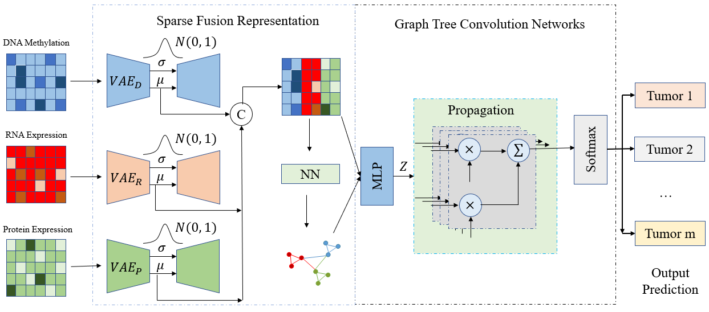

# MOVNG

This repo is the implementation for paper <font color=Yellow>**'MOVNG: Applied a Novel Sparse Fusion Representation into GTCN
for Pan-cancer Classification and Biomarker Identification'** </font>.

# Architecture of MOVNG


# Prerequisites

* python >= 3.x
* pytorch >= 1.1.x
* PyG 
* We provide the dependency file of our experimental environment, you can install 
all dependencies by creating a new anaconda virtual environment and running 
```shell
pip install -r requirements.txt
```